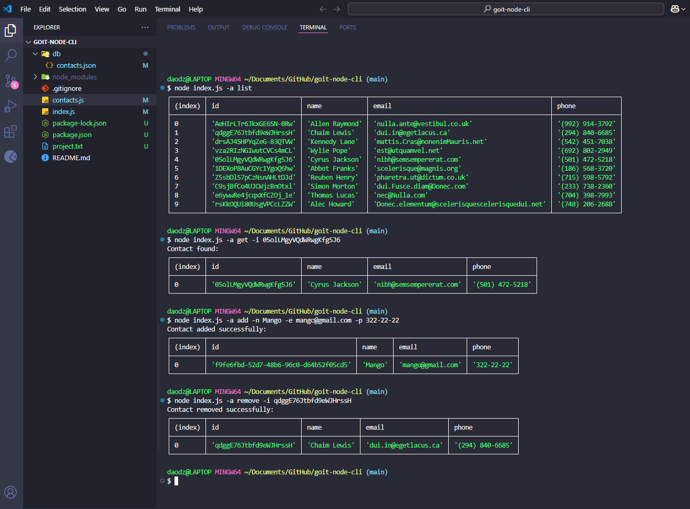

# Node.js Command Line Contacts Manager

A simple command-line application for managing contacts built with Node.js. This application allows you to perform CRUD operations (Create, Read, Update, Delete) on a contacts list stored in a JSON file.

## Features

- List all contacts
- Get contact details by ID
- Add new contacts
- Remove existing contacts

## Project Structure

```
goit-node-cli/
├── index.js       # Main application entry point
├── contacts.js    # Core functionality for contacts operations
├── package.json   # Project dependencies and configuration
└── db/
    └── contacts.json  # Storage file for contacts data
```

## Solution



## Prerequisites

- Node.js (version 18 or higher)
- npm (comes with Node.js)

## Installation

1. Clone this repository:

   ```
   git clone https://github.com/AM1007/goit-node-cli
   cd goit-node-cli
   ```

2. Install dependencies:

   ```
   npm install
   ```

3. Ensure the `db` directory exists:

   ```
   mkdir -p db
   ```

4. If starting with an empty contacts list, create a contacts.json file:
   ```
   echo "[]" > db/contacts.json
   ```

## Usage

The application uses command-line options to perform different actions:

### List all contacts

```
node index.js --action list
```

or using the shorthand:

```
node index.js -a list
```

### Get contact by ID

```
node index.js --action get --id <contact_id>
```

or using the shorthand:

```
node index.js -a get -i <contact_id>
```

### Add a new contact

```
node index.js --action add --name "John Doe" --email "john@example.com" --phone "(123) 456-7890"
```

or using the shorthand:

```
node index.js -a add -n "John Doe" -e "john@example.com" -p "(123) 456-7890"
```

### Remove a contact

```
node index.js --action remove --id <contact_id>
```

or using the shorthand:

```
node index.js -a remove -i <contact_id>
```

## Technical Details

- Built using ES Modules (specified in package.json with `"type": "module"`)
- Uses the Commander.js library for parsing command-line arguments
- Contact data is stored in a JSON file for persistence
- Generates unique IDs for contacts using Node.js crypto module

## Dependencies

- **commander**: For parsing command-line options and arguments
- **nodemon**: Used during development for automatic restarting

## Development

To run the application in development mode with automatic restart on file changes:

```
npm run dev
```

## License

ISC
